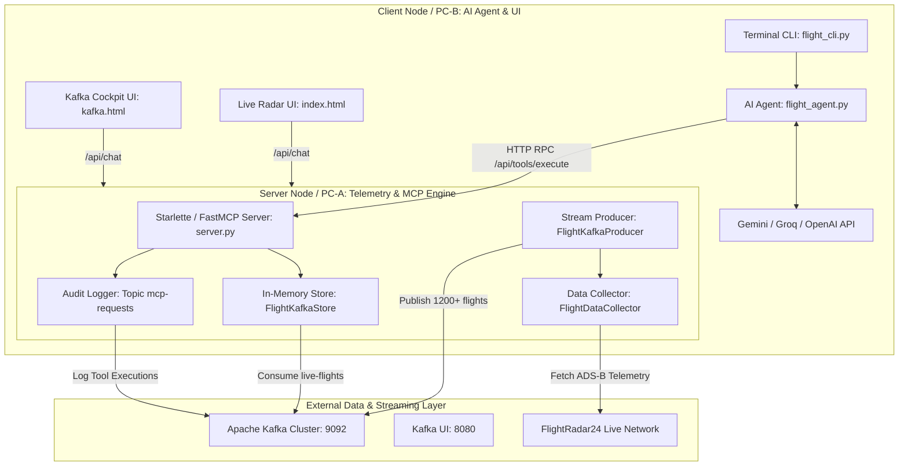

# ✈️ Semalar — Live Flight Radar & Apache Kafka Telemetry Platform

<p align="center">
  <b>Real-Time ADS-B Aircraft Tracking, High-Throughput Apache Kafka Stream Engine, and AI Aviation Assistant powered by Streamable HTTP Model Context Protocol (MCP)</b>
</p>

---

## 🌟 Overview

**Semalar** is a distributed, high-performance aviation intelligence platform that integrates:
1. **Live ADS-B Aircraft Telemetry**: Direct integration with the global FlightRadar24 network for live airborne flight tracking, airport info, and regional radar scans.
2. **Apache Kafka Stream Engine**: High-throughput telemetry ingestion, buffering 1200+ active flights in-memory for sub-millisecond querying, statistical analytics, and supersonic flight filtering.
3. **Streamable HTTP MCP Server**: RFC-compliant Model Context Protocol server exposing 11 specialized aviation and Kafka tools.
4. **Multi-Provider AI Flight Agent**: Zero-hallucination conversational AI agent supporting **Google Gemini (3.7 Flash / 2.5 Flash)**, **Groq**, **OpenAI**, **DeepSeek**, **OpenRouter**, and **Local Ollama**.
5. **Dual Web Cockpits & Terminal CLI**:
   - 🔴 **1. Project — Live Radar & AI Chat UI**: `http://localhost:8000`
   - ⚡ **2. Project — Kafka Telemetry Cockpit**: `http://localhost:8000/kafka`
   - 📊 **Apache Kafka UI Panel**: `http://localhost:8080`
   - 💻 **Interactive Terminal CLI**: `python backend/flight_cli.py`

---

## 🏗️ Distributed Architecture

The system is decoupled into independent nodes, enabling it to run seamlessly on a single machine or distributed across multiple physical machines over local network / internet:



---

## 📁 Repository Structure

```text
Semalar/
├── backend/
│   ├── core/                  # Shared core infrastructure
│   │   ├── geo_service.py     # 81-Province GeoJSON boundary & ray-casting PIP engine
│   │   ├── llm_client.py      # Multi-provider LLM caller (Gemini/Groq/OpenAI/Ollama) & observability
│   │   └── data/              # tr-cities.json & tr-provinces-catalog.json
│   ├── project_live/          # 1. Project: Live FlightRadar24 Radar & Airspace
│   │   ├── flight_service.py  # Direct live FlightRadar24 API service
│   │   ├── live_agent.py      # Isolated Live Radar AI Agent & MCP tools
│   │   ├── live_cli.py        # Dedicated Live Radar terminal CLI
│   │   └── live_server.py     # Standalone Live Radar ASGI & FastMCP Server (Port 8000)
│   ├── project_kafka/         # 2. Project: Apache Kafka Telemetry Cockpit
│   │   ├── flight_collector.py# FlightRadar24 live scraper & normalizer
│   │   ├── flight_producer.py # Real-time streaming Kafka producer daemon (15s cycle)
│   │   ├── flight_kafka_store.py # In-memory Kafka stream consumer, indexer & polygon filter
│   │   ├── kafka_agent.py     # Isolated Kafka Telemetry AI Agent & MCP tool
│   │   ├── kafka_cli.py       # Dedicated Kafka Cockpit terminal CLI
│   │   └── kafka_server.py    # Standalone Kafka Cockpit ASGI & FastMCP Server (Port 8001)
│   ├── server.py              # Central Starlette ASGI & FastMCP Server (Port 8000, mounts both)
│   └── test_flight_mcp.py     # Automated MCP protocol verification script
├── frontend/
│   ├── index.html             # 1. Project: Live Flight Radar & AI Assistant
│   ├── kafka.html             # 2. Project: Apache Kafka 1200+ Telemetry Cockpit
│   ├── css/
│   │   └── style.css          # Dark-mode glassmorphic aviation design system
│   └── js/
│       ├── app.jsx            # React Live Radar frontend
│       ├── kafka_app.jsx      # React Kafka Dashboard frontend
│       ├── api.js             # API client service
│       └── components/        # Reusable React components
├── docker-compose.yml         # Apache Kafka (KRaft mode) & Kafka UI stack
├── requirements.txt           # Python dependencies
├── .env                       # API keys & configuration
└── README.md                  # Comprehensive documentation
```

---

## 📋 Registered MCP Aviation Tools (6 Unified Tools)

Every tool is decorated with `@audit_tool`, which automatically records execution time ($ms$), argument payloads, and record counts to the Kafka `mcp-requests` audit topic in real-time.

| Tool Name | Parameters | Description |
| :--- | :--- | :--- |
| **`query_kafka_stream`** | `query`, `airline`, `min_speed_kmh`, `max_speed_kmh`, `latitude`, `longitude`, `radius_km`, `get_stats`, `limit` | **Unified multi-filter query tool for Apache Kafka telemetry.** Enables simultaneous compound filtering across ground speed, geographic coordinates/radius, airline, flight number, and stream statistics in a single sub-millisecond pass. |
| **`get_flight_info`** | `query: str` | Live global search on FlightRadar24 network by flight number (`TK10`), callsign (`THY9UC`), or registration (`TC-JYA`). |
| **`search_airline_flights`** | `airline_code: str`, `limit: int` | Direct live FlightRadar query for active airborne flights of a given airline. |
| **`get_flights_over_region`** | `latitude`, `longitude`, `radius_km` | Direct live FlightRadar regional radar scan around coordinates. |
| **`get_most_tracked_flights`** | `limit: int` | Returns top most-tracked live flights in the world on FlightRadar24. |
| **`get_airport_info`** | `airport_code: str` | Retrieves airport metadata, coordinates, elevation, and ground traffic (e.g. `IST`, `SAW`, `LHR`, `JFK`). |

---

## 🚀 Quick Start Guide

### 1. Prerequisites
- Python 3.10+
- Docker & Docker Compose (for Kafka cluster)
- Google Gemini API Key (or OpenAI / Groq / OpenRouter key)

### 2. Environment Configuration
Create a `.env` file in the project root:
```env
# LLM Provider: "gemini", "groq", "openrouter", "openai", "deepseek", "ollama"
LLM_PROVIDER=gemini

# Google Gemini API Key
GEMINI_API_KEY=AIzaSy...your_gemini_api_key_here
GEMINI_MODEL=gemini-3.7-flash

# Groq / OpenAI (Optional)
GROQ_API_KEY=gsk_...
GROQ_MODEL=qwen/qwen3.6-27b

# MCP Server Endpoint
MCP_SERVER_URL=http://localhost:8000
```

### 3. Start Apache Kafka & Kafka UI
```bash
docker compose up -d
```
- **Apache Kafka Broker**: `localhost:9092`
- **Apache Kafka UI Panel**: 👉 **`http://localhost:8080`**

### 4. Start the Application Server
```bash
python backend/server.py
```

### 5. Access the Web Interfaces
- **1. Project (Live Radar & AI Assistant)**: 👉 **`http://localhost:8000`**
- **2. Project (Kafka Telemetry Cockpit)**: 👉 **`http://localhost:8000/kafka`**
- **MCP Protocol Endpoint**: 👉 **`http://localhost:8000/mcp`**

---

## 🖥️ Distributed Deployment (Running Across 2 Different PCs)

Because the AI Agent (`flight_agent.py`) communicates with the MCP server via standard HTTP RPC, you can separate the workload across multiple machines:

```text
[PC-A: Server Node (192.168.1.100)]               [PC-B: AI Agent Client Node]
  - Docker (Kafka :9092)                             - Only needs Python + .env
  - python backend/server.py (port 8000)             - MCP_SERVER_URL=http://192.168.1.100:8000
                                                     - python backend/flight_cli.py
```

1. **On Server PC (PC-A)**: Run `python backend/server.py`.
2. **On Client PC (PC-B)**: Set `MCP_SERVER_URL=http://<PC-A-IP>:8000` in `.env` and run `python backend/flight_cli.py`.

---

## 💬 Sample AI Assistant Queries

You can ask questions in natural language (English or Turkish) in the Web Chat or Terminal CLI:

- *"Show me all flights in the Kafka buffer flying faster than 900 km/h and their aircraft models."*
- *"What are the current Kafka stream telemetry stats? What is the maximum speed recorded?"*
- *"Where is flight THY10 right now, what is its altitude, ground speed, and route?"*
- *"What are the top 3 most tracked flights in the world right now?"*
- *"Scan the airspace around Istanbul coordinates (41.0082, 28.9784) with a 200 km radius."*
- *"List all airborne Pegasus (PGT) flights currently in flight."*
- *"Give me full airport information for IST and SAW."*

---


