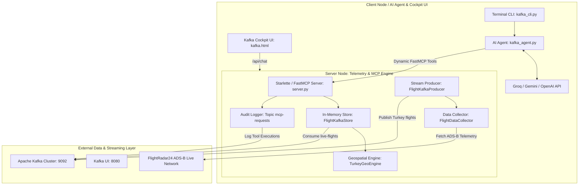

# ✈️ Semalar — Apache Kafka Live Flight Telemetry & AI Cockpit Platform

<p align="center">
  <b>Real-Time ADS-B Aircraft Tracking, High-Throughput Apache Kafka Stream Engine, 81 Turkish Province Polygon Engine, and AI Aviation Assistant powered by Streamable HTTP Model Context Protocol (MCP)</b>
</p>

---

## 🌟 Overview

**Semalar** is a distributed, high-performance aviation intelligence platform that integrates:
1. **Live ADS-B Telemetry Pipeline**: Continuous ingestion of all active flights in Turkish airspace (~500+ aircraft) from FlightRadar24.
2. **Apache Kafka Stream Engine**: High-throughput streaming to Kafka topic `live-flights`, buffering records in-memory for sub-millisecond querying, statistical analytics, and supersonic flight filtering.
3. **81-Province Polygon Geospatial Engine**: Exact boundary containment evaluations via sub-millisecond Ray-Casting Point-in-Polygon (PIP) algorithms across all 81 Turkish provinces and 7 macro-regions.
4. **Streamable HTTP FastMCP Server**: Official RFC-compliant Model Context Protocol server exposing `query_kafka_stream` over HTTP JSON-RPC (`http://localhost:8000/mcp`).
5. **Multi-Provider AI Flight Agent**: Zero-hallucination conversational AI agent supporting **Groq (Qwen 2.5 / Llama 3.3)**, **Google Gemini (3.7 Flash / 2.5 Flash)**, **OpenAI**, **DeepSeek**, **OpenRouter**, and **Local Ollama**.
6. **Real-Time Kafka Audit Logging**: Automatic telemetry pipeline pushing every MCP tool call, execution metrics, and latency to the Kafka `mcp-requests` topic.
7. **Web Cockpit & Terminal CLI**:
   - ⚡ **Kafka Telemetry Cockpit UI**: `http://localhost:8000`
   - 📊 **Apache Kafka UI Panel**: `http://localhost:8080`
   - 💻 **Interactive Terminal CLI**: `python backend/project_kafka/kafka_cli.py`

---

## 🏗️ Distributed Architecture



---

## 📁 Repository Structure

```text
Semalar/
├── backend/
│   ├── core/                  # Shared core infrastructure
│   │   ├── geo_service.py     # 81-Province GeoJSON boundary & ray-casting PIP engine
│   │   ├── audit_logger.py    # Real-time Kafka 'mcp-requests' audit producer & ring buffer
│   │   ├── llm_client.py      # Multi-provider LLM caller (Groq/Gemini/OpenAI) & Thinking timeline
│   │   └── data/              # tr-cities.json & tr-provinces-catalog.json
│   ├── project_kafka/         # Apache Kafka Telemetry Cockpit
│   │   ├── flight_collector.py# FlightRadar24 live scraper & normalizer
│   │   ├── flight_producer.py # Real-time streaming Kafka producer daemon (15s cycle)
│   │   ├── flight_kafka_store.py # In-memory Kafka stream consumer, indexer & polygon filter
│   │   ├── kafka_agent.py     # FastMCP-powered Telemetry AI Agent
│   │   └── kafka_cli.py       # Dedicated Kafka Cockpit terminal CLI
│   ├── server.py              # Central Unified Starlette ASGI & FastMCP Server (Port 8000)
│   └── test_flight_mcp.py     # Automated MCP protocol verification script
├── frontend/
│   ├── kafka.html             # Apache Kafka Telemetry Cockpit & AI Thinking Chat UI
│   └── css/
│       └── style.css          # Dark-mode glassmorphic aviation HUD design system
├── docker-compose.yml         # Apache Kafka (KRaft mode) & Kafka UI stack
├── requirements.txt           # Python dependencies
├── .env                       # API keys & configuration
└── README.md                  # Documentation
```

---

## 📋 FastMCP Havacılık Araçları Kataloğu (7 Aktif MCP Tool)

Her araç çağrısı `core.audit_logger` tarafından araya girilerek yakalanır; milisaniye cinsinden icra süresi, parametreler, durum ve eşleşen kayıt sayısı gerçek zamanlı olarak Kafka `mcp-requests` denetim topic'ine aktarılır.

| # | FastMCP Tool | Açıklama | Anahtar Parametreler |
| :--- | :--- | :--- | :--- |
| 1 | **`query_kafka_stream`** | 81 il poligonu, hız, irtifa, havayolu ve uçuş kodu bazlı birleşik canlı telemetri sorgusu. | `query`, `region`, `airline`, `min_speed_kmh`, `min_altitude_feet`, `get_stats`, `limit` |
| 2 | **`get_emergency_flights`** | Squawk 7700 (Genel Acil), 7600 (Telsiz Kaybı), 7500 (Kaçırılma) ve ani acil irtifa kaybı tespiti. | `emergency_type`, `include_rapid_descent`, `limit` |
| 3 | **`find_nearby_aircraft`** | Şehir merkezi, havalimanı veya koordinat etrafındaki $X$ km yarıçapında mesafeye göre yakın uçak araması. | `location`, `latitude`, `longitude`, `radius_km`, `min_altitude_feet`, `limit` |
| 4 | **`get_airport_traffic`** | Türkiye havalimanları (IST, SAW, ESB, AYT vb.) için iniş yaklaşması (inbound), kalkış (outbound) ve terminal trafiği. | `airport_code`, `traffic_type`, `airline`, `limit` |
| 5 | **`get_vertical_rate_flights`** | Dikey hız telemetrisi (fpm): tırmanışta olan (> +500 fpm), alçalan (< -500 fpm) veya seyirdeki uçuşlar. | `flight_phase`, `min_vertical_speed_fpm`, `region`, `airline`, `limit` |
| 6 | **`get_transit_flights`** | Türkiye hava sahasını sadece üst geçiş (transit) olarak kullanan uluslararası koridor uçuşları. | `min_altitude_feet`, `airline`, `limit` |
| 7 | **`get_fleet_aircraft_analytics`** | Havada aktif uçak modelleri (B777, A350, B737 vb.) dağılımı, geniş/dar gövde payları ve havayolu analitiği. | `aircraft_family`, `airline`, `include_breakdown` |

---

## 🚀 Quickstart

### 1. Start Apache Kafka Cluster
```bash
docker compose up -d
```
Verify Kafka UI at [http://localhost:8080](http://localhost:8080).

### 2. Install Dependencies
```bash
pip install -r requirements.txt
```

### 3. Configure `.env`
```env
GROQ_API_KEY=your_groq_api_key
# or GEMINI_API_KEY=your_gemini_api_key
```

### 4. Run the Unified Server
```bash
python backend/server.py
```
Open **[http://localhost:8000](http://localhost:8000)** in your browser.

### 5. (Optional) Run Interactive Terminal CLI
```bash
python backend/project_kafka/kafka_cli.py "Ankara semalarında 800 km/s üzeri uçaklar"
```
