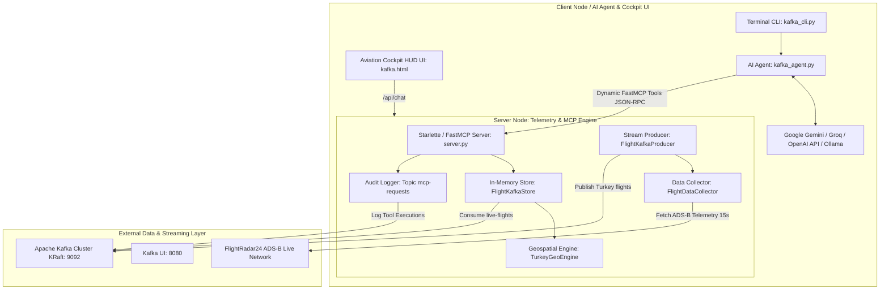

# ✈️ Semalar — Apache Kafka Live Flight Telemetry & AI Cockpit Platform

<p align="center">
  <b>Real-Time ADS-B Aircraft Tracking, High-Throughput Apache Kafka Stream Engine, 81 Turkish Province Polygon Engine, and AI Aviation Cockpit Assistant powered by Streamable HTTP Model Context Protocol (MCP)</b>
</p>

---

## 🌟 Overview

**Semalar** is a distributed, high-performance aviation intelligence platform that integrates:
1. **Live ADS-B Telemetry Pipeline**: Continuous ingestion and normalization of all active aircraft in Turkish airspace (~500+ flights) from FlightRadar24.
2. **Apache Kafka Stream Engine (KRaft Mode)**: High-throughput streaming to Kafka topic `live-flights`, buffering records in-memory for sub-millisecond querying, statistical analytics, and flight telemetry filtering.
3. **81-Province Polygon Geospatial Engine**: Exact boundary containment evaluations via sub-millisecond Ray-Casting Point-in-Polygon (PIP) algorithms across all 81 Turkish provinces, districts, and 7 macro-regions.
4. **Streamable HTTP FastMCP Server**: Official RFC-compliant Model Context Protocol server exposing 8 operational aviation tools over HTTP JSON-RPC (`http://localhost:8000/mcp`).
5. **Multi-Provider AI Flight Agent**: Zero-hallucination conversational AI agent supporting **Google Gemini (3.7 / 2.5 Flash)**, **Groq (Qwen 2.5 / Llama 3.3)**, **OpenAI (GPT-4o)**, **DeepSeek**, **OpenRouter**, and **Local Ollama**.
6. **Real-Time Kafka Audit Logging**: Automatic telemetry pipeline pushing every MCP tool call, execution latency (in milliseconds), arguments, and status to the Kafka `mcp-requests` topic.
7. **Aviation HUD Cockpit & Terminal CLI**:
   - ⚡ **Semalar Telemetry Cockpit UI**: `http://localhost:8000/semalar` (Dark-mode glassmorphic radar interface)
   - 📊 **Apache Kafka UI Panel**: `http://localhost:8080` (KRaft cluster, topic consumer & audit viewer)
   - 💻 **Interactive Terminal CLI**: `python backend/project_kafka/kafka_cli.py`

---

## 🏗️ Distributed Architecture


```mermaid
graph TD
    subgraph ClientNode [Client Node / AI Agent & Cockpit UI]
        CLI[Terminal CLI: kafka_cli.py]
        WebCockpit[Aviation Cockpit HUD UI: kafka.html]
        Agent[AI Agent: kafka_agent.py]
        LLM[Google Gemini / Groq / OpenAI API / Ollama]
        
        Agent <--> LLM
        CLI --> Agent
        WebCockpit -->|/api/chat| ServerNode
    end

    subgraph ServerNode [Server Node: Telemetry & MCP Engine]
        Server[Starlette / FastMCP Server: server.py]
        KStore[In-Memory Store: FlightKafkaStore]
        GeoEngine[Geospatial Engine: TurkeyGeoEngine]
        Producer[Stream Producer: FlightKafkaProducer]
        Collector[Data Collector: FlightDataCollector]
        Audit[Audit Logger: Topic mcp-requests]
        
        Server --> KStore
        Server --> Audit
        KStore --> GeoEngine
        Producer --> Collector
    end

    subgraph ExternalServices [External Data & Streaming Layer]
        Kafka[Apache Kafka Cluster KRaft: 9092]
        KafkaUI[Kafka UI: 8080]
        FR24[FlightRadar24 ADS-B Live Network]
    end

    Agent -->|Dynamic FastMCP Tools JSON-RPC| Server
    Producer -->|Publish Turkey flights| Kafka
    KStore -->|Consume live-flights| Kafka
    Collector -->|Fetch ADS-B Telemetry 15s| FR24
    Audit -->|Log Tool Executions| Kafka
```

---

## 📁 Repository Structure

```text
Semalar/
├── backend/
│   ├── core/                  # Shared core infrastructure
│   │   ├── geo_service.py     # 81-Province GeoJSON boundary & ray-casting PIP engine
│   │   ├── audit_logger.py    # Real-time Kafka 'mcp-requests' audit producer & ring buffer
│   │   ├── llm_client.py      # Multi-provider LLM caller (Gemini/Groq/OpenAI) & Thinking timeline
│   │   └── data/              # tr-cities.json & tr-provinces-catalog.json
│   ├── project_kafka/         # Apache Kafka Telemetry Cockpit
│   │   ├── flight_collector.py# FlightRadar24 live scraper & normalizer (15s cycle)
│   │   ├── flight_producer.py # Real-time streaming Kafka producer daemon
│   │   ├── flight_kafka_store.py # In-memory Kafka stream consumer, indexer & spatial filter
│   │   ├── kafka_agent.py     # FastMCP-powered Telemetry AI Agent & system instruction
│   │   └── kafka_cli.py       # Dedicated Kafka Cockpit terminal CLI
│   ├── server.py              # Central Unified Starlette ASGI & FastMCP Server (Port 8000)
│   └── test_flight_mcp.py     # Automated MCP protocol verification & test suite
├── frontend/
│   ├── kafka.html             # Aviation Cockpit UI, Leaflet Radar Map & AI Chat
│   ├── semalar.html           # Cockpit HTML alias
│   └── css/
│       └── style.css          # Dark-mode glassmorphic aviation HUD design system
├── docker-compose.yml         # Apache Kafka (KRaft mode) & Kafka UI stack
├── requirements.txt           # Python dependencies
├── .env                       # API keys & model configuration
└── README.md                  # Comprehensive Documentation
```

---

## 📋 FastMCP Havacılık Araçları Kataloğu (8 Aktif MCP Tool)

Her araç çağrısı `core.audit_logger` (@audit_tool) tarafından araya girilerek milisaniye cinsinden icra süresi, parametreler, durum ve eşleşen kayıt sayısı gerçek zamanlı olarak Kafka `mcp-requests` denetim topic'ine aktarılır.

| # | FastMCP Tool | Açıklama | Anahtar Parametreler |
| :--- | :--- | :--- | :--- |
| 1 | **`query_kafka_stream`** | 81 il poligonu, hız, irtifa, havayolu ve uçuş kodu bazlı birleşik canlı telemetri sorgusu. | `city`, `region`, `query`, `airline`, `min_speed_kmh`, `min_altitude_feet`, `get_stats`, `limit` |
| 2 | **`get_emergency_flights`** | Squawk 7700 (Genel Acil), 7600 (Telsiz Kaybı), 7500 (Kaçırılma) ve ani acil irtifa kaybı (<-3000 fpm) tespiti. | `emergency_type`, `include_rapid_descent`, `limit` |
| 3 | **`find_nearby_aircraft`** | Şehir merkezi, havalimanı veya koordinat etrafındaki $X$ km yarıçapında Haversine mesafesine göre yakın uçak araması. | `location`, `latitude`, `longitude`, `radius_km`, `min_altitude_feet`, `limit` |
| 4 | **`get_airport_traffic`** | Türkiye havalimanları (IST, SAW, ESB, AYT vb.) için iniş yaklaşması (inbound), kalkış (outbound) ve terminal trafiği. | `airport_code`, `traffic_type`, `airline`, `limit` |
| 5 | **`get_vertical_rate_flights`** | Dikey hız telemetrisi (fpm): tırmanışta olan (> +500 fpm), alçalan (< -500 fpm) veya seyirdeki uçuşlar. | `flight_phase`, `min_vertical_speed_fpm`, `region`, `airline`, `limit` |
| 6 | **`get_transit_flights`** | Türkiye hava sahasını sadece üst geçiş (transit) olarak kullanan uluslararası koridor uçuşları. | `min_altitude_feet`, `airline`, `limit` |
| 7 | **`get_fleet_aircraft_analytics`** | Havada aktif uçak modelleri (B777, A350, B737 vb.) dağılımı, geniş/dar gövde payları ve havayolu analitiği. | `aircraft_family`, `airline`, `include_breakdown` |
| 8 | **`detect_airspace_conflicts`** | Aktif uçak çiftlerini tarayarak yatay ve dikey ayırma ihlalleri (Loss of Separation) ve TCAS uyarı tespiti. | `min_horizontal_km`, `min_vertical_feet`, `limit` |

---

## 🎯 Canlı Sistem Doğrulama & Uç Test Senaryoları

Sistem aşağıdaki gibi çok katmanlı, coğrafi ve dinamik telemetri sorgularını sıfır halüsinasyonla çözer:

1. **Sıra Dışı Dikey Tırmanış:**
   > *"Şu an hava sahasında tırmanış açısı en dik olan dakikada +2.500 feet'in üzerinde irtifa kazanan uçak hangisi, hangi şehirden havalandı ve anlık yönü (heading) nedir? En yükseğini ver sadece."*
   > ➔ `get_vertical_rate_flights(flight_phase='CLIMBING', min_vertical_speed_fpm=2500, limit=1)` tetiklenir; uçağın +3.456 ft/dk dikey hızı, 87° yön açısı ve IST ➔ AYT rotası haritada tekil olarak parlar.

2. **Kritik Emniyet & Squawk Taraması:**
   > *"Şu an Türk hava sahasında acil durum squawk kodu (7700/7600/7500) veya dakikada 3000 feet'ten hızlı irtifa kaybeden uçak var mı?"*
   > ➔ `get_emergency_flights(include_rapid_descent=True)` ile tüm hava sahası saniyeler içinde taranır.

3. **İlçe Normalizasyonu & 81 İl Poligon Ray-Casting:**
   > *"Bodrum ve İzmir semalarında 30.000 feet üzerindeki uçaklar hangileri?"*
   > ➔ `query_kafka_stream(city='Muğla')` ve `query_kafka_stream(city='İzmir')` Ray-Casting PIP sınır kontrolüyle kesin il sınırları içinde kalan uçuşları döndürür.

4. **Terminal Radar Yaklaşması (Haversine Distance):**
   > *"İstanbul Havalimanı (IST) merkezli 40 km yarıçapında iniş yaklaşmasındaki uçakları piste en yakından uzağa sırala."*
   > ➔ `find_nearby_aircraft(location='IST', radius_km=40)` ile mesafeye göre sıralı terminal radar kuyruğu sunulur.

---

## 🚀 Quickstart

### 1. Start Apache Kafka Cluster (KRaft Mode)
```bash
docker compose up -d
```
Verify Kafka UI at **[http://localhost:8080](http://localhost:8080)**.

### 2. Activate Virtual Environment & Install Dependencies
```bash
.\.venv\Scripts\Activate.ps1
pip install -r requirements.txt
```

### 3. Configure `.env`
```env
LLM_PROVIDER=gemini
GEMINI_API_KEY=your_gemini_api_key
GEMINI_MODEL=gemini-3.7-flash
# or GROQ_API_KEY=your_groq_api_key / OPENAI_API_KEY=your_openai_key
```

### 4. Run the Unified Server
```bash
python backend/server.py
```
Open **[http://localhost:8000/semalar](http://localhost:8000/semalar)** in your browser.

### 5. Automated Protocol Verification Test
```bash
python backend/test_flight_mcp.py
```

### 6. (Optional) Run Interactive Terminal CLI
```bash
python backend/project_kafka/kafka_cli.py "Ankara semalarında 800 km/s üzeri uçaklar"
```
